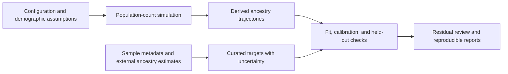

# Architecture and Current Scope

[Back to the project introduction](../README.md)

IndoEuroPop connects explicit demographic assumptions to ancestry trajectories,
then compares those trajectories with separately curated target observations.
It includes simulation, data preparation, exploratory calibration, validation,
and reporting workflows. Their outputs remain research and review artifacts;
a successful run or improved fit does not establish a historical cause.

## Two central engineering decisions

### 1. Derive ancestry from population counts

`PopulationState` stores counts by region and source. Ancestry is calculated as
a source count divided by the region's total population; it is not a separate
value that the simulator can adjust to improve fit. Births, deaths, migration,
and configured stresses change the counts first.

This gives ancestry changes a traceable demographic explanation within the
model. It does not show that those processes occurred historically. The main
simulator currently advances `local` and `steppe` counts using deterministic
mean-field steps or a seeded tau-leap approximation. Regional and source
parameter tables and time-bounded schedules make assumptions configurable.

The implementation lives in [`models/population.py`](../src/indoeuropop/models/population.py)
and [`simulation/engine.py`](../src/indoeuropop/simulation/engine.py). See
[parameter tables](parameter-tables.md) and [event schedules](event-schedules.md)
for configuration details.

### 2. Keep evidence and comparisons auditable

Target observations remain separate from simulator logic. They carry source
labels, dates, uncertainty, citations, and synthetic/published status. The
sample-to-target pipeline preserves curation metadata and propagates uncertainty.
Reviewed target decisions can retain or defer observations while preserving the
underlying evidence.

Comparisons expose raw residuals alongside uncertainty-aware chi-square and
z-score diagnostics. The selected metric matters: RMSE does not weight
residuals by target uncertainty. Explicit calibration and validation splits
check performance on held-out targets, while artifact checksums, simulation
fingerprints, and experiment manifests identify the inputs and outputs behind
a comparison. These tools support review; they do not replace it.

See the [target-data pipeline](target-data-pipeline.md),
[target decisions](target-decisions.md), [fit scoring](target-fit-scoring.md),
[validation splits](validation-splits.md), and
[experiment manifests](experiment-manifests.md).

## How the parts fit together

The Python package separates these responsibilities:

| Package area | Responsibility |
| --- | --- |
| `models` | Validated population states and demographic parameter structures. |
| `simulation` | Deterministic and stochastic steps, configuration, and event schedules. |
| `data` | Source catalogs, AADR annotation loading, external qpAdm results, target curation, and aggregation. |
| `analysis` | Fit scores, sweep diagnostics, calibration, validation, and candidate comparisons. |
| `orchestration` | Reusable workflows and CLI commands that connect inputs, analysis, and outputs. |
| `reporting` | Plots, CSV and Markdown reports, provenance, fingerprints, and review diagnostics. |

The [workflow API](workflow-api.md) exposes configured simulation execution
outside the CLI. AADR genotype inputs and qpAdm computation remain an external
handoff described in the [qpAdm workflow](qpadm-workflow.md).

## Implemented capabilities

### Simulation and model experiments

The main engine runs deterministic or seeded stochastic trajectories from TOML
configuration, supports regional/source overrides and migration or stress
windows, and produces ancestry and population plots. Diagnostics check time
ordering, labels, extinction, and growth; comparison helpers expose differences
between deterministic and stochastic runs.

[Age structure](age-structure.md), [sex-biased reproduction](sex-biased-reproduction.md),
and [epidemic compartments](epidemic-compartments.md) have separate state and
projection helpers that can collapse back to source counts. They are not wired
into the main simulator by default.

### Evidence preparation and review

Source catalogs and download manifests track local or external inputs. AADR
annotation loaders and group suggestions support reviewable sample selection.
External qpAdm estimates can be converted, filtered, aggregated into ancestry
targets, and combined with reviewed target decisions. Rerun planning and
residual audits retain links to the evidence that motivated a decision.

Start with the [real-target workflow](real-target-workflow.md), then use the
[target-curation audit](target-curation-audit.md) when a poor fit needs
sample-level investigation.

### Calibration and validation

Seeded Latin-hypercube sweeps rank parameter settings and support sensitivity
analysis. ABC-style rejection selects accepted sweep samples; bounded
ABC-SMC-style sequential calibration narrows proposal ranges over generations.
Posterior predictive diagnostic workflows compare accepted-run predictions with
targets. Structural workflows compare migration pulses and child-region
overrides, including validation folds and sensitivity checks.

These implementations support exploratory calibration. The sequential sampler
is not a fully weighted particle posterior. Names such as "posterior summary"
and "posterior predictive" describe implemented diagnostic artifacts, not a
claim that demographic history has been inferred.

See [parameter sweeps](parameter-sweeps.md),
[target comparison](target-comparison-workflow.md), and
[target fit and structural checks](target-fit-scoring.md).

### Reproducible outputs

Workflows can export plots, rectangular CSV tables, Markdown reviews, provenance
records, and JSON manifests. Canonical SHA-256 fingerprints identify simulation
and sweep output. Emulator helpers prepare training matrices and compare
supplied predictions with simulator summaries; they do not train a predictive
emulator.

See [output provenance](output-provenance.md),
[reproducibility fingerprints](reproducibility-fingerprints.md),
[emulator training data](emulator-training.md), and
[emulator validation](emulator-validation.md).

## Current limits

- **Simplified demography:** the main engine uses two source categories and
  configurable rates. Age, sex, and epidemic transmission extensions remain
  separate scaffolds. Epidemic stress in the main engine is an externally
  specified mortality hazard, not a fitted pathogen transmission process.
- **External genetic analysis:** the package does not itself process ancient-DNA
  genotypes into ancestry estimates. It prepares inputs for and consumes
  results from external qpAdm work. Downloaded data and generated artifacts are
  kept outside version control under root-level `data/` and `results/`.
- **Incomplete inference integration:** fully weighted ABC-SMC, predictive
  emulator training, and Poseidon, SLiM, or msprime integration are not included.
  Regionally calibrated parameter priors remain future work.
- **Interpretation requires evidence:** target selection, ancestry methods,
  uncertainty assumptions, and model structure can affect rankings. Neither a
  fitted curve nor a reviewed candidate proves plague, violence, migration, or
  reproductive advantage caused a particular historical transition.

The [research background](research-background.md) explains the motivating
questions. The [project plan](project-plan.md) records the longer roadmap and
scientific guardrails.
